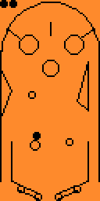
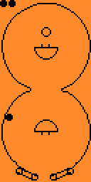
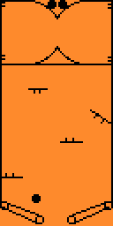

# Pinball0 (Pinball Zero)
Play pinball on your Flipperzero!

Still a work in progress...

[Latest version v0.3](https://github.com/rdefeo/pinball0/releases)

> The default tables and example tables may / will change

## Screenshots

## Features
* Realistic physics and collisions
* User-defined tables via JSON files
* Bumpers, flat surfaces, curved surfaces
* Scores! (no high scores yet, just a running tally as you play)
* Table bumps! (Don't tilt the table!)
* Portals!
* Rollover items
* Sounds! Blinky lights! Annoying vibrations!
* Customizable notification settings: sound, LED, vibration
* Idle timeout to save battery - will exit after ~120 seconds of no key-presses

## Controls
* **Ok** to release the ball
* **Left** and **Right** to activate the left and right flippers
* **Back** to return to the main menu or exit
* **Up** to "bump" the table if the ball gets stuck

I find it easiest to hold the flipper with both hands so I can hit left/right with my thumbs!

## Settings
The **SETTINGS** menu will be the "last" table listed. You can Enable / Disable the following: Sound, LED light, Vibration, and Debug mode. Move Up/Down to select your setting and press **OK** to toggle. Settings are saved in `/data/.pinball0.conf` as a native Flipper Format file. **Back** will return you to the main menu.

**Debug** mode allows you to move the ball using the directional pad _before_ the ball is launched. This is useful for testing and may be removed in the future. (May result in unexpected behavior.) It also displays test tables on the main menu. The test tables will only show/hide after you exit and restart the app. This feature is mainly for me - lol.

## Tables
Pinball0 ships with several default tables. These tables are automatically deployed into the assets folder (`/apps_data/pinball0`) on your SD card. Tables are simple JSON which means you can define your own! Your tables should be stored in the data folder (`/apps_data/pinball0`). On the main menu, tables are sorted alphabetically. In order to "force" a sorting order, you can prepend any filename with `NN_` where `NN` is between `00` and `99`. When the files are displayed on the menu, if they start with `NN_`, that will be stripped - but their sorted order will be preserved.

> The default tables may change over time.

In **Debug** mode, test tables will be shown. A test table is one that begins with the text `dbg`. Given that you can prefix table names for sorting purposes, here are two valid table filenames for a test table called `my FLIPS`: `dbg my FLIPS.json` and `04_dbg my FLIPS.json`. In both cases it will be displayed as `dbg my FLIPS` on the menu. I doubt that you will use this feature, but I'm documenting it anyway.

### File Format
Table units are specified at a 10x scale. This means our table is **630 x 1270** in size (as the F0 display is 64 pixels x 128 pixels). Our origin is in the top-left at 0, 0. Check out the default tables in the `assets/tables` folder for example usage.

These JSON elements are all defined at the top-level. The JSON can include comments - because why not!

> **DISCLAIMER:** The file format may change from release to release. Sorry. There is some basic error checking when reading / parsing the table files. If the error is serious enough, you will see an error message in the app. Otherwise, check the console logs. For those familiar with `ufbt`, simply run `ufbt cli` and issue the `log` command. Then launch Pinball0. All informational and higher logs will be displayed. These logs are useful when reporting bugs/issues!

#### lives : object (optional)
Defines how many lives/balls you start with, and display information

* `"display": bool` : optional, defaults to false
* `"position": [ X, Y ]`
* `"value": N` : Number of balls - optional, defaults to 3
* `"align": A` : optional, defaults to `"HORIZONTAL"` (also, `"VERTICAL"`)

#### balls : list of objects
Every table needs at least 1 ball, otherwise it will fail to load.

* `"position": [ X, Y ]`
* `"velocity": [ VX, VY ]` : optional, defaults to `[ 0, 0 ]`. The default tables have an initial velocity magnitude in the 10-18 range. Test your own values!
* `"radius" : N` : optional, defaults to `20`

#### score : object (optional)
* `"display" : bool` : optional, defaults to false
* `"position" : [ X, Y ]` : optional, defaults to `[ 63, 0 ]`

The position units are in absolute LCD pixels within the range [0..63], [0..127].

#### flippers : list of objects (optional)
* `"position": [ X, Y ]` : location of the pivot point
* `"side": S` : valid values are `"LEFT"` or `"RIGHT"`
* `"size": N` : optional, defaults to `120`

You can have more than 2 flippers! Try it!

#### bumpers : list of objects (optional)
* `"position": [ X, Y ]`
* `"radius": [ N ]` : optional, defaults to `40`

#### rails : list of objects (optional)
* `"start": [ X, Y ]`
* `"end": [ X, Y ]`
* `"double_sided": bool` : optional, defaults to `false`

The "surface" of a rail is "on the left" as we move from the `"start"` to the `"end"`. This means that when thinking about your table, the outer perimiter should be defined in a counter-clockwise order. Arriving at a rail from it's revrese side will result in a pass-through - think of it as a one-way mirror.

#### arcs : list of objects (optional)
* `"position": [ X, Y ]`
* `"radius" : N`
* `"start_angle": N` : in degrees from 0 to 360
* `"end_angle": N` : in degreens from 0 to 360
* `"surface": S` : valid values are `"INSIDE"` or `"OUTSIDE"`

Start and End angles should be specified in **counter-clockwise** order. The **surface** defines which side will bounce/reflect.

#### rollovers : list of objects (optional)
* `"position": [ X, Y ]`
* `"symbol": C` : where C is a string representing a single character, like `"Z"`

When the ball passes over/through a rollover object, the symbol will appear. Only the first character of the string is used.

#### portals : list of objects (optional)
* `"a_start": [ X, Y]`
* `"a_end": [ X, Y]`
* `"b_start": [ X, Y]`
* `"b_end": [ X, Y]`

Defines two portals, **a** and **b**. They are bi-drectional. Like rails, their "surface" - or in this case, their "entry surface" - is "on the left" from their respective start to end direction. You can't "enter" a portal from it's reverse side, you will pass through.

#### tilt_detect : boolean
* `"tilt_detect": bool` : optional, defaults to `true`

Mainly used to turn off tilt detection. Useful for tables that promote free-play and multiple table bumps without penalty.